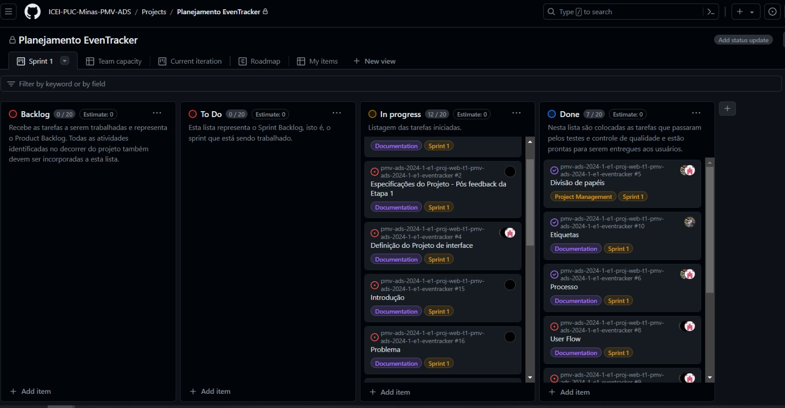

# Metodologia

## Gerenciamento de Projeto
A metodologia ágil escolhida para o desenvolvimento deste projeto foi o SCRUM, pois como citam Amaral, Fleury e Isoni (2019, p. 68), seus benefícios são a

“visão clara dos resultados a entregar; ritmo e disciplina necessários à execução; definição de papéis e responsabilidades dos integrantes do projeto (Scrum Owner, Scrum Master e Team); empoderamento dos membros da equipe de projetos para atingir o desafio; conhecimento distribuído e compartilhado de forma colaborativa; ambiência favorável para crítica às ideias e não às pessoas.”

### Divisão de Papéis

Desta forma, a equipe está organizada da seguinte maneira:
- Scrum Master: João Victor
- Product Owner: André Pedroso
- Equipe de Desenvolvimento: André Pedroso, Lucas Siqueira, João Victor, Juliana Monik
- Equipe de Design: André Pedroso, Lucas Siqueira, João Victor, Juliana Monik

### Processo

As tarefas do projeto estão sendo sendo organizadas e distribuídas através do GitHub Project, cujas estruturas são:
- Backlog: recebe as tarefas a serem trabalhadas e representa o Product Backlog. Todas as atividades identificadas no decorrer do projeto também devem ser incorporadas a esta lista. 
- To Do: essa lista representa o Sprint Backlog, isto é, o sprint que está sendo trabalhado
- In progress: listagem das tarefas iniciadas. 
- Done: nessa lista são colocadas as tarefas que passaram pelos testes e controle de qualidade e estão prontas para serem entregues aos usuários.

O quadro kanban do grupo no GitHub está disponível no link [https://github.com/ICEI-PUC-Minas-PMV-ADS/pmv-ads-2022-1-e1-proj-web-t3-vida-de-estudante/projects/2](https://github.com/orgs/ICEI-PUC-Minas-PMV-ADS/projects/1002) e é apresentado, no estado atual, na figura abaixo:

<figure>
   <figcaption>Figura 1 - Tela do kanban no GitHub utilizada pelo grupo </figcaption>
</figure>

### Etiquetas

As tarefas são, ainda, etiquetadas em função da natureza da atividade e seguem o seguinte esquema de cores/categorias:

<ul>
  <li>Bug (Erro no código)</li>
  <li>Desenvolvimento (Development)</li>
  <li>Documentação (Documentation)</li>
  <li>Gerência de Projetos (Project Management)</li>
  <li>Infraestrutura (Infrastructure)</li>
  <li>Testes (Tests)</li>
</ul>

<figure> 
  Figura 2 - Tela do esquema de cores e categorias</figcaption>
</figure> 
  
### Ferramentas

As ferramentas empregadas no projeto são:

- Editor de código: GitHub.
- Ferramentas de desenho de tela (_wireframing_) : Figma

O editor de código foi escolhido porque ele possui uma integração com o sistema de versão. As ferramentas de comunicação utilizadas possuem facilidade de uso, além de serem completas. Por fim, para criar o projeto de interface utilizou-se o Figma dada a sua interface intuitiva para criação e por melhor captar as necessidades do projeto quanto a sua representação.

Os artefatos do projeto são desenvolvidos a partir das plataformas GitHub e Figma. Seus respectivos propósitos são apresentados na tabela que se segue:

| AMBIENTE                            | PLATAFORMA                         | LINK DE ACESSO                         |
|-------------------------------------|------------------------------------|----------------------------------------|
| Repositório de código fonte         | GitHub                             | https://github.com/ICEI-PUC-Minas-PMV-ADS/pmv-ads-2024-1-e1-proj-web-t1-pmv-ads-2024-1-e1-eventracker/blob/main/codigo-fonte/README.md |
| Documentos do projeto               | GitHub                             | https://github.com/ICEI-PUC-Minas-PMV-ADS/pmv-ads-2024-1-e1-proj-web-t1-pmv-ads-2024-1-e1-eventracker |
| Projeto de Interface                | Figma                              | https://www.figma.com/file/M7UCxAQdbR7fHpxgZzfzmc/Prot%C3%B3tipo-EvenTracker?type=design&node-id=180%3A599&mode=design&t=hHSRjsdps4lyWHtJ-1 |
| Gerenciamento do Projeto            | GitHub Projects                    | https://github.com/orgs/ICEI-PUC-Minas-PMV-ADS/projects/1002 |
| Hospedagem                          | GitHub Pages                       | http://....                            |

### Estratégia de Organização de Codificação 

Todos os artefatos relacionados a implementação e visualização dos conteúdos do projeto do site deverão ser inseridos na pasta [codigo-fonte](http://https://github.com/ICEI-PUC-Minas-PMV-ADS/WebApplicationProject-Template-v2/tree/main/codigo-fonte).
