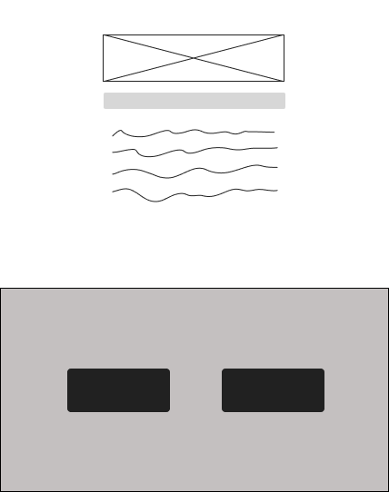
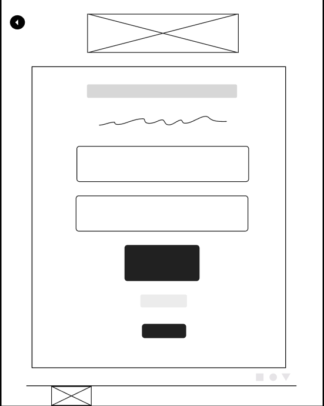
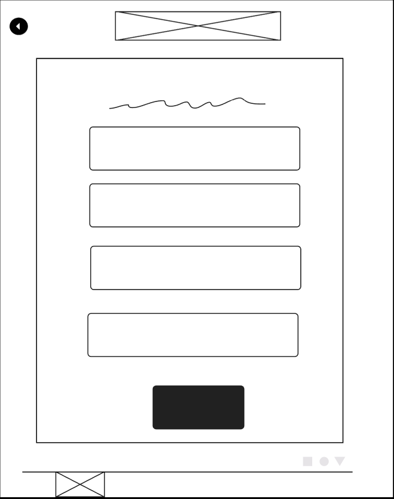
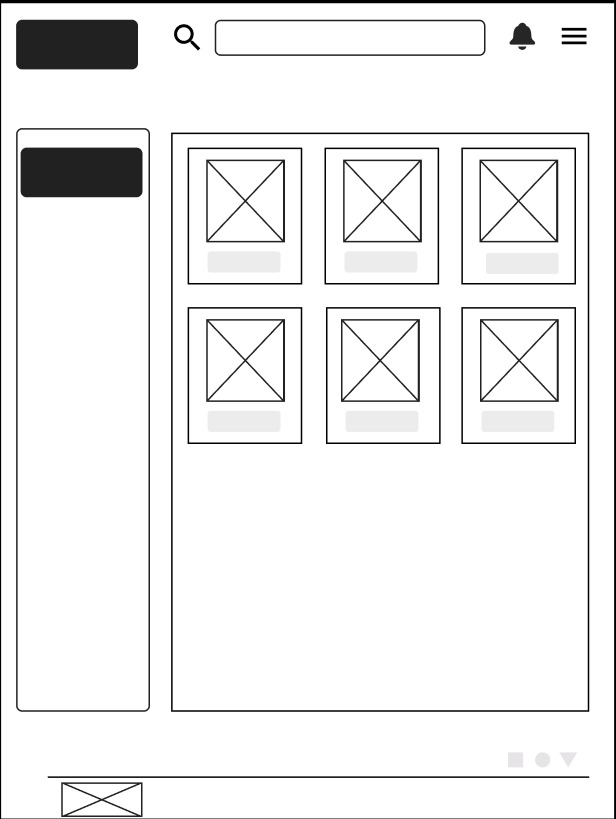
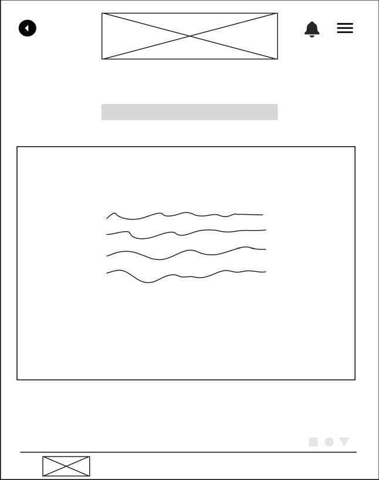
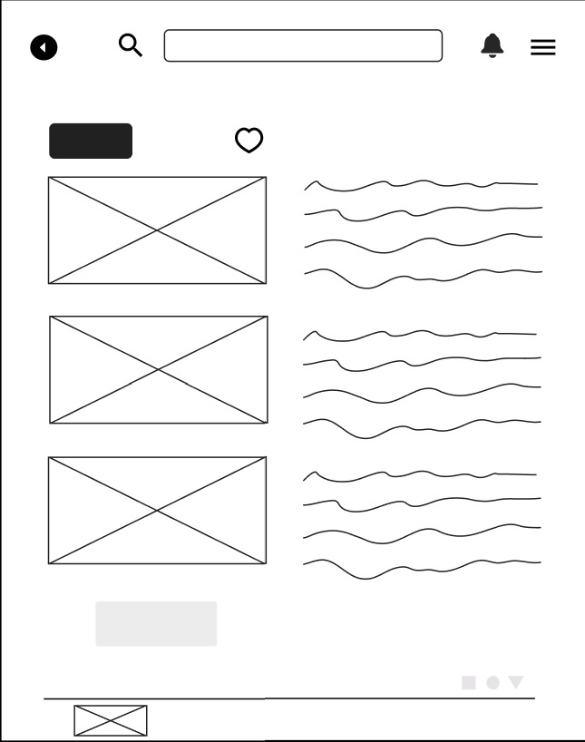
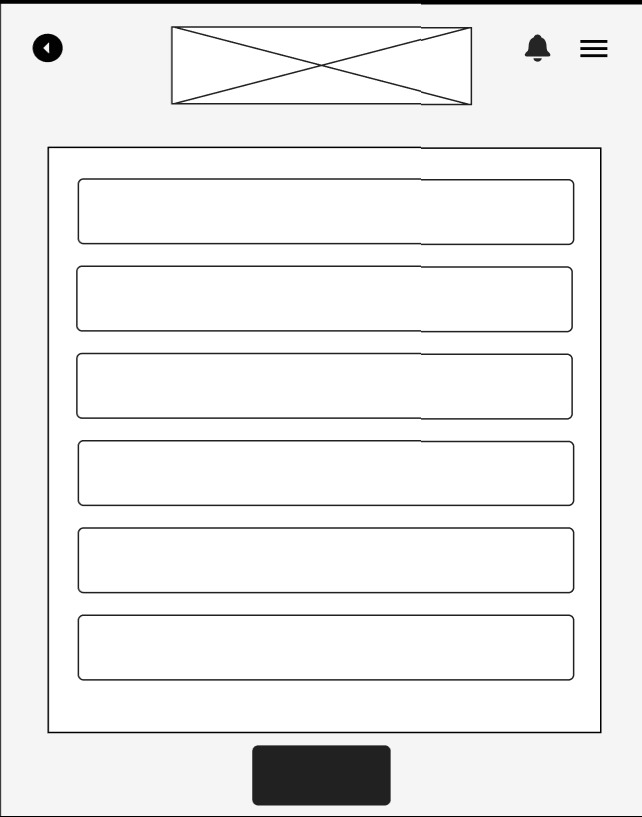
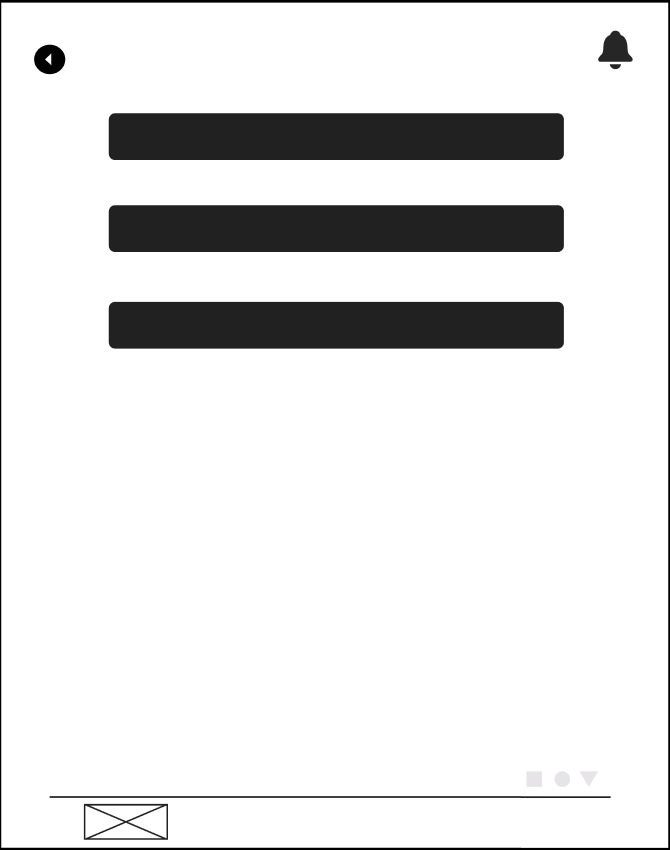
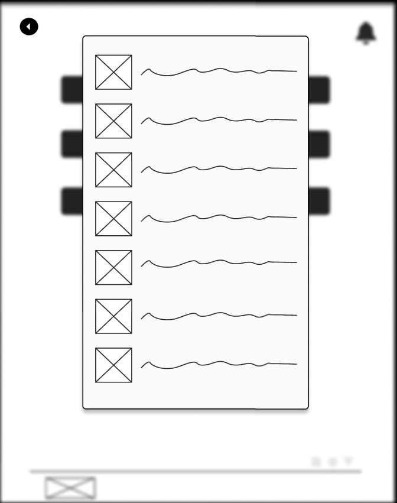
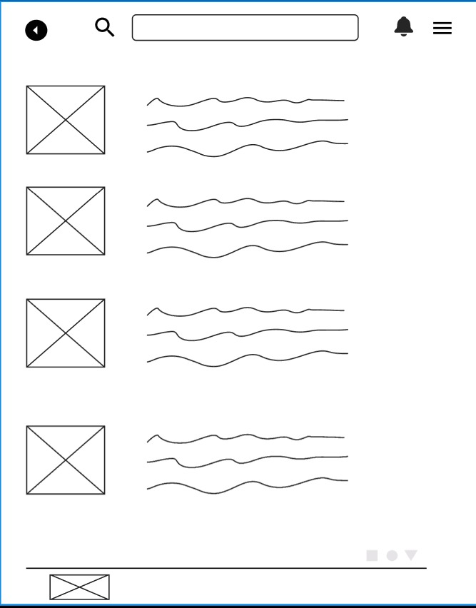

# Projeto de Interface

## User Flow

Os user flows são ferramentas que auxiliam no mapeando do caminho que os usuários percorrem para concluir tarefas do web site.
É de suma importância, pois auxiliam no planejamento do website e analisa as sequências de interações que ocorrerão ao longo do trajeto. 
O Diagrama de fluxo apresentado a seguir demonstra o fluxo seguido pelo usuário na aplicação desenvolvida nesse projeto. 

<figure>
   <figcaption>Figura 3 -Demonstração do Fluxo do Usuário </figcaption>
</figure>

## Protótipo

### Protótipo de baixa fidelidade
 Com o propósito da criação do design de interface, foi projetado o wireframe de baixa fidelidade para auxiliar na diagramação da página, com  o intuito de esboçar dessa forma o produto final. 
 
 ### Home Page: 
  A Home Page, ou seja a página principal no qual guiará o usuário como sua porta de entrada e irá direcioná-lo a outros setores do website, como por exemplo, tela principal de eventos, tela de cadastro de novos eventos e sobre nós.
  Analisando-se os Requisitos Funcionais do Usuário conforme a etapa 1 do projeto, o Wire Frame foi criado com as seguintes  estruturas, na figura 4 observa-se o componente:

  <em>• Usuários:</em>  possibilitará aos usuários fazer a escolha de entrar, seja Participante ou Organizador e ao clicar serão direcionados ao fluxo da página web almejada;
  
   <em>• Login:</em> caso o usuário já tenha uma conta, o mesmo será levado a tela de validação de login;
   
   <em>• Cadastrar conta:</em> caso o usuário não tenha uma conta, ele será levado a tela de formulário de criação de nova conta;

   <figure>
   <figcaption>Figura 4 -Homepage </figcaption>
</figure>

### Login
 A tela de Login permitirá que o usuário acesse ao Sistema, faça o seu cadastrado com as informações solicitadas, as credenciais que foram registradas auxiliará na identificação do usuário no Sistema.
 Conforme a Figura 5, os componentes são compostos por:

 <em>· Login:</em> será uma caixa de formulário com o elemento input que permitirá o usuário colocar seus dados como E-mail e Senha;

<em>· Entrar:</em>  após o usuário registrar seu email e senha, o botão Entrar permitirá que o usuário, faça o "click" e seja direcionado as outras interações do web site; 
 
 <em>· Criar Conta:</em> o botão Criar Conta após ser clicado, permitirá ao usuário registrar suas informações para efetivar o seu cadastro;

 <em>· Recuperar Senha:</em> caso o usuário esqueça de seu e-mail e senha registrados  através dessa interação irá recuperar a senha;

 <em>· Rodapé:</em> Fornecerá informações sobre a equipe que desenvolveu a solução;
 
 <em>· Voltar:</em> permite que o usuário retorne a página anterior;

 <figure>
   <figcaption>Figura 5 -Tela de Login </figcaption>
</figure>

 ### Tela Cadastro

A tela de cadastro do usuário solicitará as informações que são necessárias para a criação de sua conta e senha, dessa forma, o visitante poderá ter acesso ao seu objetivo, que será a visualização e criação de eventos, bem como o acesso a página "Sobre nós" que aparesentará mais informações sobre a solução e a equipe que desenvolveu.

 Conforme a Figura 6, a tela de Cadastro apresentará  formulários com as informaçōes pessoais do usuário como por exemplo: Nome, Idade, Cidade, Contato.
  
 <em>· Cadastro:</em> será um formulário que deverá ser preenchido pelo usuário informando os dados: Nome, Idade, Cidade, Contato;
 
  <em>· Cadastrar:</em> após o usuário informar os dados do formulário, o botão cadastrar vai permitir a criação da conta e o usuário será levado para a tela principal do site;
  
  <em>· Rodapé:</em> Fornecerá informações sobre a equipe que desenvolveu a solução;
  
  <em>· Voltar:</em> permite que o usuário retorne a página anterior;

<figure>
   <figcaption>Figura 6 -Tela de cadastro de novas contas </figcaption>
</figure>

### Tela Principal
 A tela Principal guiará o usuário, após ter sua conta cadastrada, aos links que direcionará o visitante para outras páginas do site. 

 · Conforme a Figura 7, será possível navegar por todos os eventos disponíveis bem como visualiza-los por categorias, pesquisar por eventos específicos na barra de pesquisa. Ao selecionar um evento o usuário será direcionado a tela de detalhe desse evento e também poderá acessar o formulário de criação de novos eventos através da tela principal.

 <em>· Botão de Menu</em>: ao clicar no botão Menu, o usuário será apresentado as funcionalidades específicas que o usuário deseja interagir no website; 

  <em>· Botão notificação</em>: ao clicar no botão (símbolo de notificação) o usuário poderá visualizar todas as notificações sobre os eventos favoritos e com presença marcada pelo usuário que estão perto de ocorrerem;
  
 <em>· Barra de pesquisa</em>: aqui o usuário poderá pesquisar por eventos específicos;
 
  <em>· Botão Novo Evento</em>: ao realizar o click aqui, o usuário/organizador será direcionado a tela de formulário para criação de um novo evento;

   <em>· Botão Categorias</em>: aqui serão dispostas as categorias de divisão de eventos por gênero, bem como a categoria que mostra todos os eventos, os eventos favoritos e com presença confirmada, e categoria "Meus eventos" que trará os eventos criados pelo usuário;

  <em>· Botão Evento</em>: o usuário poderá pré-visualizar informações do evento como nome, imagem adicionada pelo organizador e uma pequena descrição. Ao selecionar o evento desejado, o usuário é encaminhado para a tela de detalhes do evento;

  <em>·Rodapé:</em> Fornecerá informações sobre a equipe que desenvolveu a solução;

<figure>
   <figcaption>Figura 7 -Tela principal </figcaption>
</figure>

### Sobre Nós

A tela Sobre Nós permitirá ao usuário compreender por qual motivo o website foi criado e conhecer sobre a equipe que esta construindo o website. 

  Na figura 8 terá os componentes:

   <em>· Botão de Menu</em>: ao clicar no botão Menu, o usuário será apresentado as funcionalidades específicas que o usuário deseja interagir no website;

  <em>· Botão notificação</em>: ao clicar no botão (símbolo de notificação) o usuário poderá visualizar todas as notificações sobre os eventos favoritos e com presença marcada pelo usuário que estão perto de ocorrerem;
   
   <em>· Rodapé:</em> Fornecerá informações sobre a equipe que desenvolveu a solução;
 
  <em>· Voltar:</em> permite que o usuário retorne a página anterior;

<figure>
   <figcaption>Figura 8 -Sobre nós </figcaption>
</figure>

  ### Tela de Detalhe do Evento 
  A tela Detalhes do Evento possibilitará que o usuário verifique informações mais completas do evento, bem como o nome do evento, as imagens publicadas pelo organizador, o horário e data de realização, o local onde o evento ocorrerá, a descrição formada pelo próprio organizador, as atrações que comparecerão, se o evento fornece estrutura e apoio para PCD, o nome e contato do organizador e por fim o número de pessoas com presença confirmada. Além de permitir que o usuário adicione o evento a sua lista de favoritos e confirme sua presença.

Conforme a Figura 9, terá os seguintes componentes:

 <em>· Botão de Menu</em>: ao clicar no botão Menu, o usuário será apresentado as funcionalidades específicas que o usuário deseja interagir no website;

<em>· Botão notificação</em>: ao clicar no botão (símbolo de notificação) o usuário poderá visualizar todas as notificações sobre os eventos favoritos e com presença marcada pelo usuário que estão perto de ocorrerem;

<em>· Barra de pesquisa</em>: aqui o usuário poderá pesquisar por eventos específicos;
 
 <em>· Detalhes do evento</em>: o usuário poderá verificar informações importantes para o seu planejamento bem como o montante de pessoas que comparecerão;

 <em>· Botão confirmar presença</em>: ao clicar, o usuário confirmará sua presença, contabilizando no número de pessoas que comparecerão e adicionará esse evento a sua categoria de eventos confirmados;

 <em>· Botão adicionar aos favoritos </em>: ao realizar o click, o usuário irá adicionar esse evento a sua categoria de eventos favoritos;
 
 <em>· Rodapé:</em> Fornecerá informações sobre a equipe que desenvolveu a solução;
 
  <em>· Voltar:</em> permite que o usuário retorne a página anterior;
 
<figure>
   <figcaption>Figura 9 -Tela de detalhes do eventos </figcaption>
</figure>

  ### Tela de Cadastro de Eventos
  A Tela de Cadastro de eventos é destinada a criação que o usuário/Organizador fará de novos eventos. Nela terá um formulário em que o usuário irá informar: o nome do evento, as atrações do evento, a quais categorias esse evento se enquadra, a descrição desse evento, o local de realização, o horário de realização, qual tipo de apoio e estrutura o evento oferece a pessoa PCD, o nome do Organizador seja pessoa ou empresa, dados de contato do organizador e poderá adicionar imagens do evento, como imagem de divulgação, etc.

  Conforme a Figura 10, terá os seguintes componentes:

 <em>· Botão de Menu</em>: ao clicar no botão Menu, o usuário será apresentado as funcionalidades específicas que o usuário deseja interagir no website;

 <em>· Botão notificação</em>: ao clicar no botão (símbolo de notificação) o usuário poderá visualizar todas as notificações sobre os eventos favoritos e com presença marcada pelo usuário que estão perto de ocorrerem;

<em>· Cadastro de novo evento:</em> será um formulário que deverá ser preenchido pelo usuário informando os dados: nome do evento, as atrações do evento, a quais categorias esse evento se enquadra, a descrição desse evento, o local de realização, o horário de realização, qual tipo de apoio e estrutura o evento oferece a pessoa PCD, o nome do Organizador seja pessoa ou empresa, dados de contato do organizador e poderá adicionar imagens do evento, como imagem de divulgação, etc;

<em>· Botão Cadastrar novo evento:</em> ao clicar, esse evento será criado, adicionado a tela incial em suas respectivas categorias informadas e também estará na categoria "Meus eventos" do usuário;
 
 <em>· Rodapé:</em> Fornecerá informações sobre a equipe que desenvolveu a solução;
 
  <em>· Voltar:</em> permite que o usuário retorne a página anterior;
  
<figure>
   <figcaption>Figura 10 -Tela de cadastro de novo evento </figcaption>
</figure>

 ### Tela de Menu 
  A Tela de Menu do website é destinada a auxiliar na navegação do usuário por funcionalidades especificas da solução.

  Conforme a Figura 11, terá os seguintes componentes:

 <em>· Botão notificação</em>: ao clicar no botão (símbolo de notificação) o usuário poderá visualizar todas as notificações sobre os eventos favoritos e com presença marcada pelo usuário que estão perto de ocorrerem;
 
 <em>· Botão Home</em>: ao realizar o click, o usuário será levado a tela da Página Principal do website;

 <em>· Botão Cadastrar Novo Evento</em>: ao clicar nesse botão, o usuário será levado a Tela de cadastro de novo evento;

 <em>· Botão Sobre Nós</em>: aqui o usuário será direcionado a tela Sobre Nós;

 <em>· Rodapé:</em> Fornecerá informações sobre a equipe que desenvolveu a solução;
 
  <em>· Voltar:</em> permite que o usuário retorne a página anterior;
  
<figure>
   <figcaption>Figura 11 -Tela de menu do site </figcaption>
</figure>

 ### Tela de Notificações
  A Tela de Notificação será responsável por apresentar as notificações dos eventos favoritos e com presença marcada pelo usuário que estão perto de ocorrerem.

  Conforme a Figura 12, terá os seguintes componentes:

  <em>· Notificações</em>: aqui serão apresentadas ao usuário a imagem do evento, o nome e uma mensagem indicando a data e hora de realização do evento;
 
  <em>· Voltar:</em> permite que o usuário retorne a página anterior;
  
<figure>
   <figcaption>Figura 12 -Tela de Notificações de eventos </figcaption>
</figure>

 ### Tela de Pesquisa de eventos 
  A Tela de Pesquisa de eventos será responsável por trazer os eventos correspondentes com as palavras digitadas pelo usuário na barra de pesquisa.

  Conforme a Figura 13, terá os seguintes componentes:

<em>· Botão notificação</em>: ao clicar no botão (símbolo de notificação) o usuário poderá visualizar todas as notificações sobre os eventos favoritos e com presença marcada pelo usuário que estão perto de ocorrerem;

<em>· Barra de pesquisa</em>: aqui o usuário poderá pesquisar por eventos específicos;

<em>· Resultados da pesquisa</em>: serão apresentados os eventos que correspondem as características pesquisadas pelo usuário, mostrando também a imagem do evento e sua breve descrição. Ao clicar no evento desejado o usuário será levado a tela de Detalhes do Evento.
  
 <em>· Rodapé:</em> Fornecerá informações sobre a equipe que desenvolveu a solução;
 
  <em>· Voltar:</em> permite que o usuário retorne a página anterior;
  
<figure>
   <figcaption>Figura 13 -Tela de Pesquisa de eventos </figcaption>
</figure>
