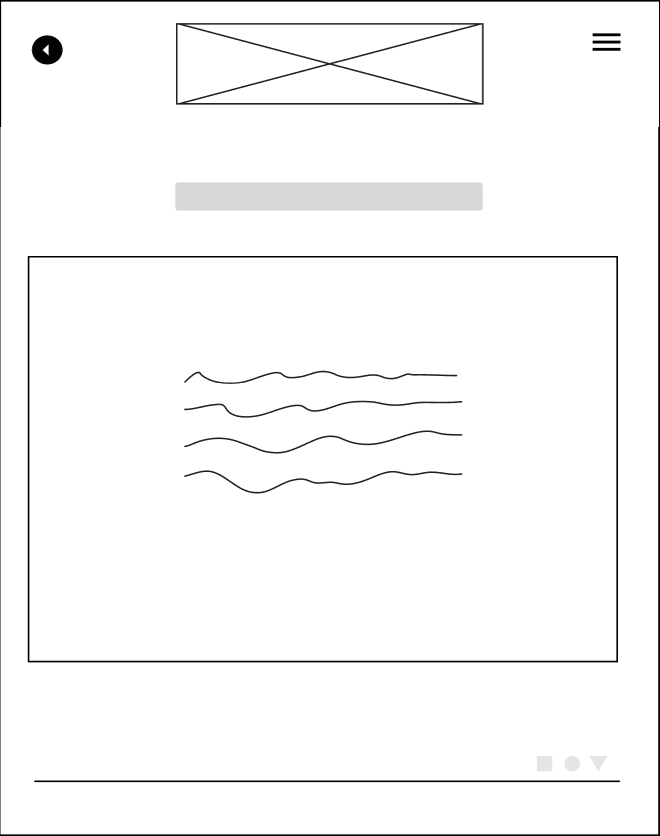
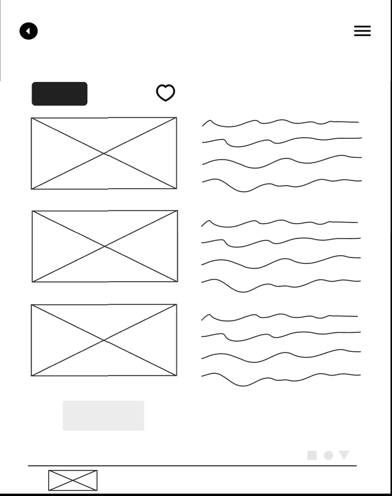
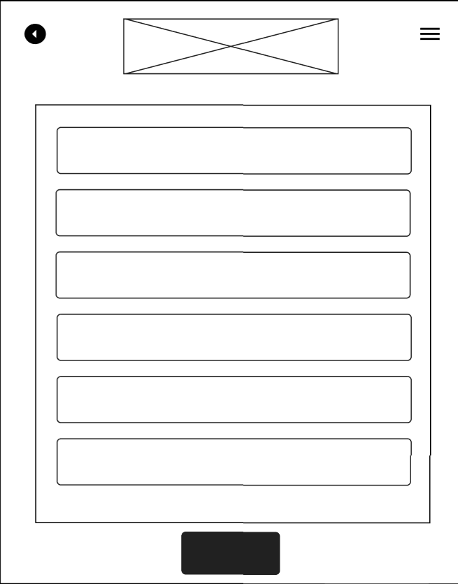

# Projeto de Interface

## User Flow

Os user flows são ferramentas que auxiliam no mapeando do caminho que os usuários percorrem para concluir tarefas do web site.
É de suma importância, pois auxiliam no planejamento do website e analisa as sequências de interações que ocorrerão ao longo do trajeto. 
O Diagrama de fluxo apresentado a seguir demonstra o fluxo seguido pelo usuário na aplicação desenvolvida nesse projeto. 

<figure>
   <figcaption>Figura 4 -Demonstração do Fluxo do Usuário </figcaption>
</figure>

## Protótipo

## Protótipo

### Protótipo de baixa fidelidade
 Com o propósito da criação do design de interface, foi projetado o wireframe de baixa fidelidade para auxiliar na diagramação da página, com  o intuito de esboçar dessa forma o produto final. 
 
 ### Home Page: 
  A Home Page, ou seja a página principal no qual guiará o usuário como sua porta de entrada e irá direcioná-lo a outros setores do website, como por exemplo, tela princiapl de eventos, tela de cadastro de novos eventos e sobre nós.
  Analisando-se os Requisitos Funcionais do Usuário conforme a etapa 1 do projeto, o Wire Frame foi criado com as seguintes  estruturas, na figura 5 observa-se o componente:

  <em>•Usuários:</em>  possibilitará aos usuários fazer a escolha de entrar, seja Participante ou Organizador e ao clicar serão direcionados ao fluxo da página web almejada;

   <figure>
   <figcaption>Figura 5 -Homepage </figcaption>
</figure>

### Login
 A tela de Login permitirá que o usuário acesse ao Sistema, faça o seu cadastrado com as informações solicitadas, as credenciais que foram registradas auxiliará na identificação do usuário no Sistema.
 Conforme a Figura 6, os componentes são compostos por:

 <em>· Login:</em> será uma caixa de formulário com o elemento input que permitirá o usuário colocar seus dados como E-mail e Senha;

<em>·Entrar:</em>  após o usuário registrar seu email e senha, o botão Entrar permitirá que o usuário, faça o "click" e seja direcionado as outras interações do web site; 
 
 <em>·Criar Conta:</em> o botão Criar Conta após ser clicado, permitirá ao usuário registrar suas informações para efetivar o seu cadastro;

 <em>·Recuperar Senha:</em> caso o usuário esqueça de seu e-mail e senha registrados  através dessa interação irá recuperar a senha.

 <em>·Rodapé:</em> Fornecerá informações sobre a equipe que desenvolveu a solução.
 
 <em>·Voltar:</em> permite que o usuário retorne a págna anterior.

 <figure>
   <figcaption>Figura 6 -Tela de Login </figcaption>
</figure>

 ### Tela Cadastro

A tela de cadastro do usuário solicitará as informações que são necessárias para a criação de sua conta e senha, dessa forma, o visitante poderá ter acesso ao seu objetivo, que será a visualização e criação de eventos, bem como o acesso a página "Sobre nós" que aparesentará mais informações sobre a solução e a equipe que desenvolveu.

 Conforme a Figura 7, a tela de Cadastro apresentará  formulários com as informaçōes pessoais do usuário como por exemplo: Nome, Idade, Cidade, Contato.
  
 <em>· Cadastro:</em> será um formulário que deverá ser preenchido pelo usuário informando os dados: Nome, Idade, Cidade, Contato.
 
  <em>· Cadastrar:</em> após o usuário informar os dados do formulário, o botão cadastrar vai permitir a criação da conta e o usuário será levada para a tela principal do site.
  
  <em>·Rodapé:</em> Fornecerá informações sobre a equipe que desenvolveu a solução.
  
  <em>·Voltar:</em> permite que o usuário retorne a págna anterior.

<figure>
   <figcaption>Figura 7 -Tela de cadastro de novas contas </figcaption>
</figure>

### Tela Principal
 A tela Principal guiará ao usuário, após ter sua conta cadastrada aos links que direcionará ao visitante para outras páginas do site. 

 · Conforme a  Figura 8, sera possível editar fotos de perfil, alterar nomes, botões de interações que direcionarão  especificamente ao fluxo de usuário pretendido.

 <em>·Botão de Menu</em>: ao clicar no botão Menu, o usuário será apresentado as funcionalidades específicas que o usuário deseja interagir no website. 

<figure>
   <figcaption>Figura 8 -Tela principal </figcaption>
</figure>

### Sobre Nós

A tela Sobre Nós permitirá ao usuário compreender por qual motivo o website foi criado e conhecer sobre a equipe que esta construindo o website. 

  Na figura 08 terá os componentes:

  <em>·Botão de Menu:</em> ao clicar no botão Menu, o usuário será apresentado as funcionalidades específicas que o usuário deseja interagir no website.

  <em>Rodapé:</em> informações da equipe desenvolveu o website e logo. 

<figure>
   <figcaption>Figura 9 -Sobre nós </figcaption>
</figure>

  ### Tela de Detalhe do Evento 
  figura 09

<figure>
   <figcaption>Figura 10 -Tela de detalhes do eventos </figcaption>
</figure>

  ### Tela de Cadastro de Eventos
  figura 10 

<figure>
   <figcaption>Figura 11 -Tela de cadastro de novo evento </figcaption>
</figure>
