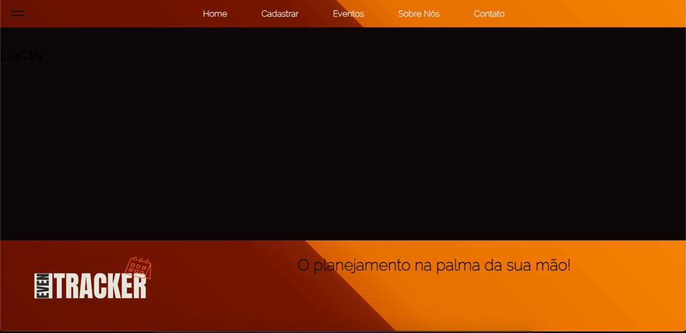

# Template padrão da Aplicação

 O layout padrão de site utilizará o HTML (Linguagem de Marcação de Hiper Texto), com a finalidade de estilizar os elementos do website será utilizado o CSS (Cascading Style Sheet) além disso, auxiliará nas características visuais e responsividade elementos inseridos. A linguagem de programação utilizada será em Java Script, que proporcionará as interatividades no site.

<figure>
   <figcaption> Figura x  - Demonstração Tela Even Tracker</figcaption>
</figure>

(colocar a figura do web site aqui e numeracao da figura) 

  Observa-se que as páginas possuirão os elementos correspondentes ao protótipo de baixa fidelidade realizado no Projeto de Interface na etapa anterior, visando dessa forma desenvolver o website promovendo acessibilidade aos usuários.
  Nota-se as seguintes estruturas :<em> • cabeçalho; </em>
                                   <em> • rodapé; </em>
                                   <em> • menu de navegação;</em>
                                   <em> • menu hamburguer;</em>
  
Cores: definir
Font-family: definir
Font-size: definir

  Na criação do logotipo foi utilizado o círculo cromático, no qual é uma ferramenta que possui a função de auxiliar sobre a  combinação de diversas cores e suas propriedades. Dessa maneira, é possível desenvolver uma paleta de cores harmônica no desenvolvimento do website. 
  
  <figure>
   <figcaption> Figura x - Logotipo Even Tracker </figcaption>
</figure>

> **Links Úteis**:
>
> - [CSS Website Layout (W3Schools)](https://www.w3schools.com/css/css_website_layout.asp)
> - [Website Page Layouts](http://www.cellbiol.com/bioinformatics_web_development/chapter-3-your-first-web-page-learning-html-and-css/website-page-layouts/)
> - [Perfect Liquid Layout](https://matthewjamestaylor.com/perfect-liquid-layouts)
> - [How and Why Icons Improve Your Web Design](https://usabilla.com/blog/how-and-why-icons-improve-you-web-design/)
