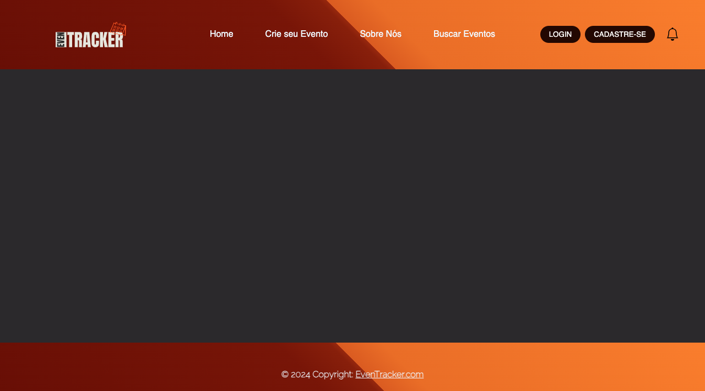

# Template padrão da Aplicação

 O layout padrão de site utilizará o HTML (Linguagem de Marcação de Hiper Texto), para estilizar os elementos do website será utilizado o CSS (Cascading Style Sheet) além disso, auxiliará nas características visuais e responsividade elementos inseridos. A linguagem de programação utilizada será em Java Script, que proporcionará as interatividades no site.

<figure>
   <figcaption> Figura 14 - Demonstração Tela Even Tracker</figcaption>
</figure>
 
 
 Observa-se que as páginas possuirão os elementos correspondentes ao protótipo de baixa fidelidade realizado no Projeto de Interface na etapa anterior, visando dessa forma desenvolver o website promovendo acessibilidade aos usuários.

  
  Nota-se as seguintes estruturas :  
  <em> • cabeçalho; </em>  
                                   <em> • rodapé; </em>   
                                   <em> • menu de navegação;</em>  
                                   <em> • menu hamburguer;</em>  
                                   <em> • Fonte: Open Sans, sans-serif;</em>  
                                   <em> • Font-size: 12px;</em>  

 - O código usado para a construção dos elementos mencionados, podem ser observado: <a href= "https://github.com/ICEI-PUC-Minas-PMV-ADS/pmv-ads-2024-1-e1-proj-web-t1-pmv-ads-2024-1-e1-eventracker/tree/main/codigo-fonte">clique aqui</a>.

 - As imagens e iconografia utilizados para a construção do web site podem ser visualizadas: <a href= "https://github.com/ICEI-PUC-Minas-PMV-ADS/pmv-ads-2024-1-e1-proj-web-t1-pmv-ads-2024-1-e1-eventracker/tree/main/documentos/img">clique aqui</a>. 

 
 Na criação do logotipo foi utilizado o círculo cromático, no qual é uma ferramenta que possui a função de auxiliar sobre a  combinação de diversas cores e suas propriedades. Dessa maneira, é possível desenvolver uma paleta de cores harmônica no desenvolvimento do website.

 
  <figure>
   <figcaption> Figura 15 - Logotipo Even Tracker </figcaption>
</figure>
  
  
