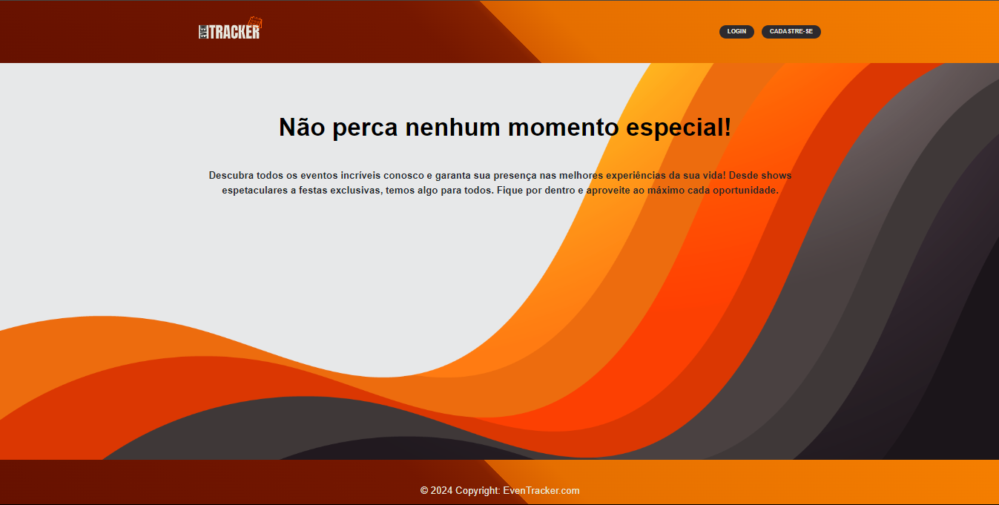
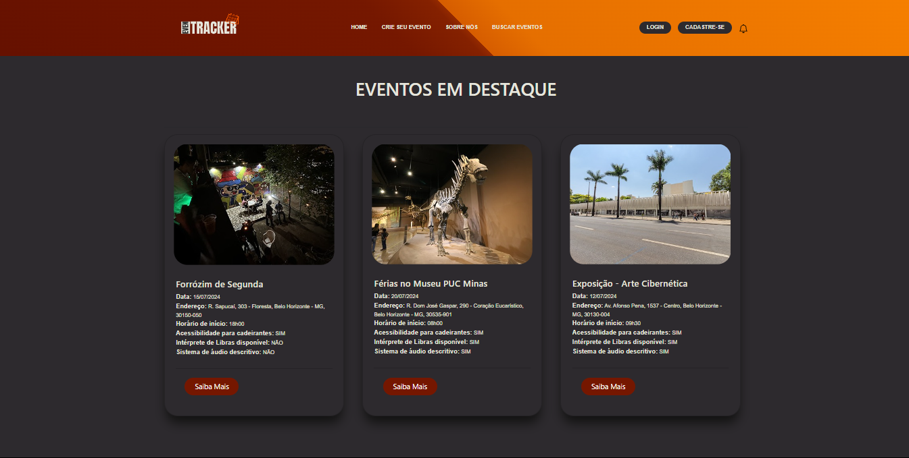
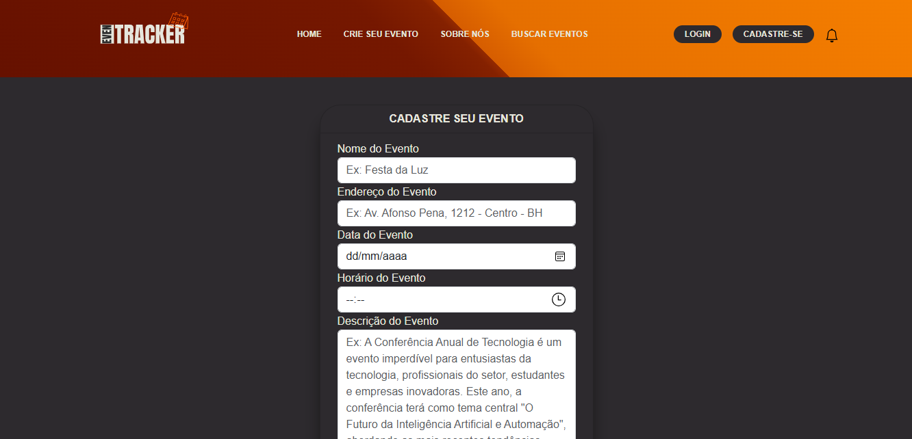
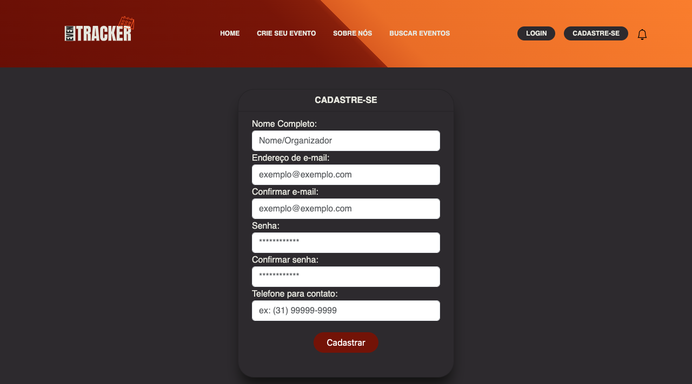
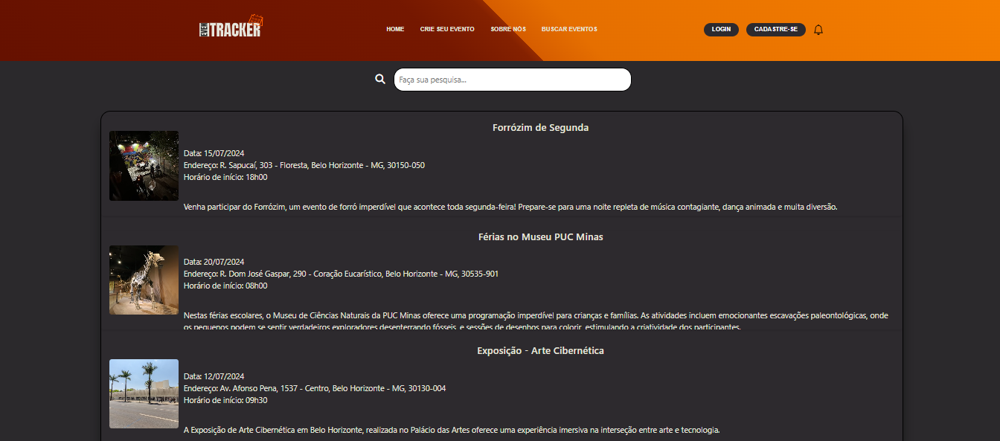

# Programação de Funcionalidades:

A tela do menu foi criada para servir como uma apresentação do nosso site. Seu principal objetivo é atrair a atenção dos usuários, despertando o interesse deles pelo conteúdo oferecido, e incentivando sua utilização para obter informações relevantes. Foram utilizados HTML, CSS, JavaScript.

### Tela Do Menu:

<figure>
   <figcaption> Figura 16 - Tela Do Menu </figcaption>

#### Requisito atendido

<b>• RF-07: </b> A aplicação deve apresentar o tipo de mídia do material disponível.
 
<b>• RNF-02:</b> A aplicação deverá ser responsiva permitindo a visualização em dispositivos diversos de forma adequada.

#### Artefatos da funcionalidade

- tela-do-menu.html

- tela-do-menu.css

- app.js

#### Estrutura de Dados

Não se aplica.

#### Instruções de acesso

<em>O usuário deverá abrir um navegador de Internet e informar a seguinte URL:<em>

https://alessandropfreitas.github.io/TelaMenu/tela-de-menu.html

#### Responsável

Alessandro Paulista e Lucas Ribeiro @ https://github.com/lsrdot

 A tela login poderá ser executada através do button “Entrar”, após o usuário digitar o e-mail e senha cadastrada.
 Foram utilizados elementos da linguagem de marcação do HTML, elementos de estilização CSS e linguagem de programação JavaScript para tornar a aplicação mais dinâmica e interativa no website.

### Tela Login:

<figure>
   <figcaption> Figura 17 - Tela Login </figcaption>
</figure>

#### Requisito atendido:

<b>• RF-02:</b> A aplicação deve permitir que o usuário faça login na sua conta cadastrada.
 
<b>• RNF-02:</b> A aplicação deverá ser responsiva permitindo a visualização em dispositivos diversos de forma adequada.

#### Artefatos da funcionalidade:

- login.html

- login.css

- login.js

#### Estrutura de Dados:

Não se aplica.

#### Instruções de acesso:

<em>O usuário deverá abrir um navegador de Internet e informar a seguinte URL:<em>

https://htmlpreview.github.io/?https://github.com/ICEI-PUC-Minas-PMV-ADS/pmv-ads-2024-1-e1-proj-web-t1-pmv-ads-2024-1-e1-eventracker/blob/main/codigo-fonte/login/login.html

#### Responsável:

Juliana M.

 A tela Sobre Nós será direcionada após o usuário clicar no  button “ Sobre Nós” que esta no cabeçalho do website. 
 Deste modo, o usuário poderá compreender por qual motivo o projeto EvenTracker foi desenvolvido.

 Foram utilizados elementos da linguagem de marcação do HTML, elementos de estilização CSS e linguagem de programação JavaScript para tornar a aplicação mais dinâmica e interativa no website.

 ### Tela Sobre Nós:

<figure>
   Figura 18 - Tela Sobre Nós </figcaption>
</figure>

#### Requisito atendido:

<b> •RNF-02:</b> A aplicação deverá ser responsiva permitindo a visualização em dispositivos diversos de forma adequada.
 
<b> •RNF-04: </b>A aplicação deve ter bom nível de contraste entre os elementos da tela.

#### Artefatos da funcionalidade:

- sobrenos.html

- sobrenos.css

- sobrenos.js

#### Estrutura de Dados:

Não se aplica.

#### Instruções de acesso:

<em> O usuário deverá abrir um navegador de Internet e informar a seguinte URL:<em>

https://htmlpreview.github.io/?https://github.com/ICEI-PUC-Minas-PMV-ADS/pmv-ads-2024-1-e1-proj-web-t1-pmv-ads-2024-1-e1-eventracker/blob/main/codigo-fonte/sobrenos/sobrenos.html

#### Responsável:

Juliana M.

### Home Page:

<figure>
    
    <figcaption> Figura - 19 Tela Principal</figcaption>
</figure>

#### Requisitos atendidos:
**RF-05:** A aplicação deve permitir ao participante visualizar informações sobre o evento, como, imagem publicada pelo criador, descrição do evento e suas atrações, nome do criador e se o evento foi cancelado ou adiado

**RF-07:** A aplicação deve permitir ao participante visualizar informações sobre o evento, como, imagem publicada pelo criador, descrição do evento e suas atrações

**RF-08:** A aplicação deve separar os eventos por categorias.

#### Artefatos da funcionalidade:

- index.html

- style.css

- bootstrap.min.css

- bootstrap.min.js

#### Estrutura de Dados:

Não se aplica.

#### Instruções de acesso:

Acesso de forma local:

O usuário deverá clonar o repositório localmente e navegar até o diretório em ICEI-PUC-Minas-PMV-ADS/pmv-ads-2024-1-e1-proj-web-t1-pmv-ads-2024-1-e1-eventracker/codigo-fonte/home/ e executar o arquivo index.html em seu navegador de preferência.

Forma de acesso via URL:

O usuário deverá abrir um navegador de Internet e informar a seguinte URL: https://htmlpreview.github.io/?https://github.com/ICEI-PUC-Minas-PMV-ADS/pmv-ads-2024-1-e1-proj-web-t1-pmv-ads-2024-1-e1-eventracker/blob/main/codigo-fonte/home/index.html

#### Responsável:

Author: Lucas Ribeiro @ https://github.com/lsrdot

### Detalhes do Evento:

<figure>
    
    <figcaption> Figura - 19.1 Saiba mais</figcaption>
</figure>

#### Requisitos atendidos:

**RF-07:** A aplicação deve permitir ao participante visualizar informações sobre o evento, como, imagem publicada pelo criador, descrição do evento e suas atrações

#### Artefatos da funcionalidade:

- forrozim.html

- style.css

- bootstrap.min.css

- bootstrap.min.js

#### Estrutura de Dados:

Não se aplica.

#### Instruções de acesso:

Acesso de forma local:

O usuário deverá clonar o repositório localmente e navegar até o diretório em ICEI-PUC-Minas-PMV-ADS/pmv-ads-2024-1-e1-proj-web-t1-pmv-ads-2024-1-e1-eventracker/codigo-fonte/home/ e executar o arquivo index.html em seu navegador de preferência.

Forma de acesso via URL:

O usuário deverá abrir um navegador de Internet e informar a seguinte URL: https://htmlpreview.github.io/?https://github.com/ICEI-PUC-Minas-PMV-ADS/pmv-ads-2024-1-e1-proj-web-t1-pmv-ads-2024-1-e1-eventracker/blob/main/codigo-fonte/home/index.html

#### Responsável:

Author: Lucas Ribeiro @ https://github.com/lsrdot e André Pedroso @ https://github.com/andrespedroso 

### Tela de Novo Evento:

<figure>
    
    <figcaption> Figura - 20 Tela de Novo Evento</figcaption>
</figure>

#### Requisitos atendidos:

**RF-04:** A aplicação deve permitir ao organizador que crie seu próprio evento.

**RF-05:** A aplicação deve apresentar os dados acerca dos eventos, bem como, local de realização, data e horário.

**RF-09:** A aplicação deve informar se o evento possui estrutura acessível e apoio para PCD

#### Artefatos da funcionalidade:

- index.html

- style.css

- bootstrap.min.css

- bootstrap.min.js

#### Estrutura de Dados:

Não se aplica.

#### Instruções de acesso:

Acesso de forma local:

O usuário deverá clonar o repositório localmente e navegar até o diretório em ICEI-PUC-Minas-PMV-ADS/pmv-ads-2024-1-e1-proj-web-t1-pmv-ads-2024-1-e1-eventracker/codigo-fonte/novo-evento/ e executar o arquivo index.html em seu navegador de preferência.

Forma de acesso via URL:

O usuário deverá abrir um navegador de Internet e informar a seguinte URL: https://htmlpreview.github.io/?https://github.com/ICEI-PUC-Minas-PMV-ADS/pmv-ads-2024-1-e1-proj-web-t1-pmv-ads-2024-1-e1-eventracker/blob/main/codigo-fonte/novo-evento/index.html

#### Responsável:

Lucas Ribeiro @ https://github.com/lsrdot e André Pedroso @ https://github.com/andrespedroso

### Tela Cadastro

 A tela Cadastro será direcionada após o usuário clicar no button “Cadastre-se” que esta no cabeçalho do website. 
 Deste modo, o usuário poderá se Cadastrar preenchendo as informações requisitadas como, por exemplo, Nome, Endereço de E-mail, criação de senha, ao finalizar o preenchimento dos dados deve-se finalizar clicando no button "Cadastrar".

 Foram utilizados elementos da linguagem de marcação do HTML, elementos de estilização CSS e linguagem de programação JavaScript para tornar a aplicação mais dinâmica e interativa no website e a biblioteca bootstrap.

<figure>
   <figcaption> Figura 21 - Tela Cadastro</figcaption>
</figure>

#### Requisito atendido q

•RF-01: A aplicação deve permitir ao organizador cadastrar uma conta.

•RNF-02:</b> A aplicação deverá ser responsiva permitindo a visualização em dispositivos diversos de forma adequada.

#### Artefatos da funcionalidade

- index.html

- bootstrap.bundle.min.js

- index.js

- style.css

#### Estrutura de Dados

Não se aplica.

#### Instruções de acesso

<em>O usuário deverá abrir um navegador de Internet e informar a seguinte URL:<em>

https://htmlpreview.github.io/?https://github.com/ICEI-PUC-Minas-PMV-ADS/pmv-ads-2024-1-e1-proj-web-t1-pmv-ads-2024-1-e1-eventracker/blob/main/codigo-fonte/nova-conta/index.html

#### Responsável:
Lucas Ribeiro @ https://github.com/lsrdot

### Tela Buscar Eventos 

<figure>
   <figcaption> Figura 22 - Tela Buscar Eventos</figcaption>
</figure>

 A Tela Buscar Eventos será direcionada após o usuário clicar no button "Buscar Eventos" que encontra-se no cabeçalho do website.
  Desta forma, o usuário conseguirá pesquisar no filtro de pesquisa digitando a palavra almejada. Os elementos digitados no filtro de pesquisa irá mostrar aonde tem a informação na página referida.

  
 Foram utilizados elementos da linguagem de marcação do HTML, elementos de estilização CSS e linguagem de programação JavaScript para tornar a aplicação mais dinâmica e interativa no website e a biblioteca bootstrap.

  
#### Requisito atendido:

RF-03: A aplicação deve possuir uma função de pesquisa de eventos.

•RNF-02:</b> A aplicação deverá ser responsiva permitindo a visualização em dispositivos diversos de forma adequada.

#### Artefatos da funcionalidade

- index.html

- bootstrap.bundle.min.js

- index.js

- styles.css

- app.js 

#### Estrutura de Dados

Não se aplica.

#### Instruções de acesso:

<em>O usuário deverá abrir um navegador de Internet e informar a seguinte URL:<em>

https://htmlpreview.github.io/?https://github.com/ICEI-PUC-Minas-PMV-ADS/pmv-ads-2024-1-e1-proj-web-t1-pmv-ads-2024-1-e1-eventracker/blob/main/codigo-fonte/searchbar/index.html

#### Responsável:

Maurício

