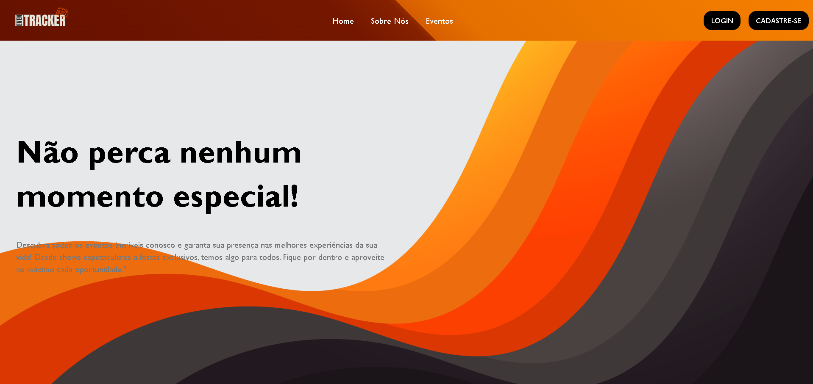
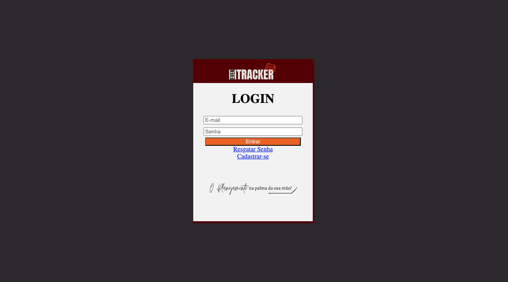
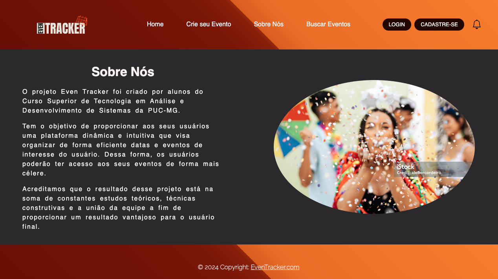
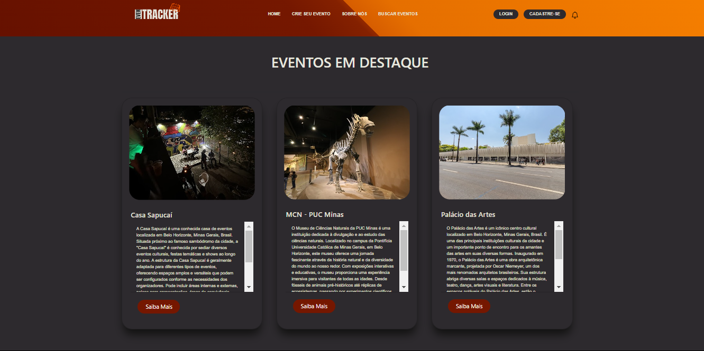

# Programação de Funcionalidades

Implementação da aplicação descritas por meio dos requisitos codificados. 

[Utilize a estrutura abaixo para cada funcionalidade entregue na etapa]

### Título da funcionalidade

[Adicione imagem da funcionalidade/tela]

#### Requisito atendido

[RF-X: adicione a descrição do requisito atendido]

#### Artefatos da funcionalidade

[Adicione os nomes dos arquivos relacionados ao desenvolvimento da funcionalidade]

#### Estrutura de Dados

[Caso exista estrutura de dados, adicione aqui]

#### Instruções de acesso

[Adicione as orientações de acesso à funcionalidade]

#### Responsável

[Adicione nome do responsável pelo desenvolvimento da funcionalidade]

# Programação de Funcionalidades:

A tela do menu foi criada com a finalidade de servir como uma apresentação do nosso site. Seu principal objetivo é atrair a atenção dos usuários, despertando o interesse deles pelo conteúdo oferecido, e incentivando sua utilização para obter informações relevantes. Foram utilizados HTML, CSS, JavaScript.

### Tela Do Menu:

<figure>
   <figcaption> Figura X - Tela Do Menu </figcaption>
</figure>

#### Requisito atendido

<b>RF-12: </b> A aplicação deve apresentar o tipo de mídia do material disponível.
 
<b>•RNF-02:</b> A aplicação deverá ser responsiva permitindo a visualização em dispositivos diversos de forma adequada.

#### Artefatos da funcionalidade

- tela-do-menu.html

- tela-do-menu.css

- app.js

#### Estrutura de Dados

Não se aplica.

#### Instruções de acesso

<em>O usuário deverá abrir um navegador de Internet e informar a seguinte URL:<em>

https://alessandropfreitas.github.io/TelaDoMenu/tela-do-menu.html

#### Responsável

Alessandro

 A tela login poderá ser executada através do button “Entrar”, após o usuário digitar o e-mail e senha cadastrada.
 Foram utilizados elementos da linguagem de marcação do HTML, elementos de estilização CSS e linguagem de programação JavaScript para tornar a aplicação mais dinâmica e interativa no website.

### Tela Login:

<figure>
   <figcaption> Figura X - Tela Login </figcaption>
</figure>

#### Requisito atendido:

<b>•RF-2:</b> A aplicação deve permitir que o usuário faça login na sua conta cadastrada.
 
<b>•RNF-02:</b> A aplicação deverá ser responsiva permitindo a visualização em dispositivos diversos de forma adequada.

#### Artefatos da funcionalidade:

- login.html

- login.css

- login.js

#### Estrutura de Dados:

Não se aplica.

#### Instruções de acesso:

<em>O usuário deverá abrir um navegador de Internet e informar a seguinte URL:<em>

https://htmlpreview.github.io/?https://github.com/ICEI-PUC-Minas-PMV-ADS/pmv-ads-2024-1-e1-proj-web-t1-pmv-ads-2024-1-e1-eventracker/blob/main/codigo-fonte/login/login.html

#### Responsável:

Juliana M.

 A tela Sobre Nós será direcionada após o usuário clicar no  button “ Sobre Nós” que esta no cabeçalho do website. 
 Deste modo, o usuário poderá compreender por qual motivo o projeto EvenTracker foi desenvolvido.

 Foram utilizados elementos da linguagem de marcação do HTML, elementos de estilização CSS e linguagem de programação JavaScript para tornar a aplicação mais dinâmica e interativa no website.

 ### Tela Sobre Nós:

<figure>
   Figura X - Tela Sobre Nós </figcaption>
</figure>

#### Requisito atendido:

<b> •RNF-02:</b> A aplicação deverá ser responsiva permitindo a visualização em dispositivos diversos de forma adequada.
 
<b> •RNF-04: </b> A aplicação deve ter bom nível de contraste entre os elementos da tela.

#### Artefatos da funcionalidade:

- sobrenos.html

- sobrenos.css

- sobrenos.js

#### Estrutura de Dados:

Não se aplica.

#### Instruções de acesso:

<em> O usuário deverá abrir um navegador de Internet e informar a seguinte URL:<em>

https://htmlpreview.github.io/?https://github.com/ICEI-PUC-Minas-PMV-ADS/pmv-ads-2024-1-e1-proj-web-t1-pmv-ads-2024-1-e1-eventracker/blob/main/codigo-fonte/sobrenos/sobrenos.html

#### Responsável:

Juliana M.

> **Links Úteis**:
> - [Trabalhando com HTML5 Local Storage e JSON](https://www.devmedia.com.br/trabalhando-com-html5-local-storage-e-json/29045)
> - [JSON Tutorial](https://www.w3resource.com/JSON)
> - [JSON - Introduction (W3Schools)](https://www.w3schools.com/js/js_json_intro.asp)
> - [JSON Tutorial (TutorialsPoint)](https://www.tutorialspoint.com/json/index.htm)

### Home Page:

<figure>
    
    <figcaption> Tela Principal</figcaption>
</figure>

#### Requisitos atendidos:

**RF-09:** A aplicação deve separar os eventos por categorias.

**RF-07:** A aplicação deve permitir ao participante visualizar informações sobre o evento, como, imagem publicada pelo criador, descrição do evento e suas atrações, nome do criador e se o evento foi cancelado ou adiado

#### Artefatos da funcionalidade:

- index.html

- style.css

- bootstrap.min.css

- bootstrap.min.js

#### Estrutura de Dados:

Não se aplica.

#### Instruções de acesso:

Acesso de forma local:

O usuário deverá clonar o repositório localmente e navegar até o diretório em ICEI-PUC-Minas-PMV-ADS/pmv-ads-2024-1-e1-proj-web-t1-pmv-ads-2024-1-e1-eventracker/codigo-fonte/home/ e executar o arquivo index.html em seu navegador de preferência.

Forma de acesso via URL:

O usuário deverá abrir um navegador de Internet e informar a seguinte URL: https://htmlpreview.github.io/?https://github.com/ICEI-PUC-Minas-PMV-ADS/pmv-ads-2024-1-e1-proj-web-t1-pmv-ads-2024-1-e1-eventracker/blob/main/codigo-fonte/home/index.html

#### Responsável:

Author: Lucas Ribeiro @ https://github.com/lsrdot
