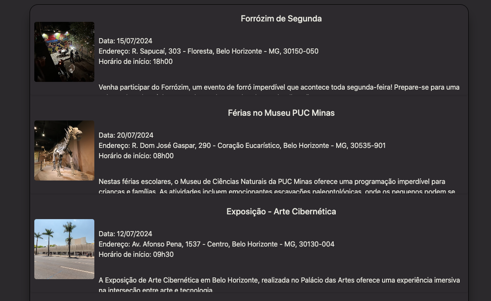

# Registro de Testes de Software

Relatório com as evidências dos testes de software realizados na aplicação pela equipe, baseado no plano de testes pré-definido.
Pré-requisitos: <a href="https://github.com/ICEI-PUC-Minas-PMV-ADS/pmv-ads-2024-1-e1-proj-web-t1-pmv-ads-2024-1-e1-eventracker/blob/main/documentos/04-Projeto%20de%20Interface.md"> Projeto de Interface</a>, <a href="https://github.com/ICEI-PUC-Minas-PMV-ADS/pmv-ads-2024-1-e1-proj-web-t1-pmv-ads-2024-1-e1-eventracker/blob/main/documentos/07-Plano%20de%20Testes%20de%20Software.md"> Plano de Testes de Software</a>

Os resultados dos testes funcionais realizados na aplicação são descritos a seguir.

 ### Caso de Teste - 01

|Caso de Teste    | CT-01: O website deverá ser responsivo e permitir a visualização em dispositivos diversos de forma satisfatória. |
|:---|:---|
| Resultados obtidos|Observa-se que o teste apresentou êxito parcialmente ao ser executado. Foram realizados testes numa tela normal de computador e em duas simulações: uma de smartphone, outra de tablet. A aplicação apresenta boa responsividade em praticamente todas as telas, porém houve um problema com a apresentação da tela "Sobre Nós" na simulação do smartphone e do tablet (iPhone SE e iPad Mini). No caso do smartphone, o menu hamburger está cortado em relação ao layout. Para o tablet, o layout ficou cortado, saindo do padrão das outras telas e a navbar não foi redimensionada a um menu hamburguer. Apesar disso, no restante das telas a aplicação oferece visualização de forma satisfatória.|
| Responsável pela execução do caso de Teste | André|

<b> - Teste executado para verificar a responsividade da aplicação em um computador.</b>

https://github.com/ICEI-PUC-Minas-PMV-ADS/pmv-ads-2024-1-e1-proj-web-t1-pmv-ads-2024-1-e1-eventracker/assets/157080144/0ad50c44-23de-4a54-acfb-e75bba4866fd

<b> - Teste executado para verificar a responsividade da aplicação em um smartphone (iPhone SE)</b>

https://github.com/ICEI-PUC-Minas-PMV-ADS/pmv-ads-2024-1-e1-proj-web-t1-pmv-ads-2024-1-e1-eventracker/assets/157080144/61f92196-15f6-4a93-ac2f-b7da326a21ab

<b> - Teste executado para verificar a responsividade da aplicação em um tablet (iPad Mini)</b>

https://github.com/ICEI-PUC-Minas-PMV-ADS/pmv-ads-2024-1-e1-proj-web-t1-pmv-ads-2024-1-e1-eventracker/assets/157080144/cbc32a65-d806-4d8f-9f8f-f283be86311a

 ### Caso de Teste - 02

|Caso de Teste    | CT-02: Verificar o Login de usuários. |
|:---|:---|
| Resultados obtidos|Os testes realizados para verificar a funcionalidade do login, conforme especificado no RF-02, demonstraram que o sistema opera de acordo com os requisitos estabelecidos. Todos os cenários foram executados com sucesso, garantindo que os usuários possam realizar o login de forma eficiente e segura, além de serem direcionados corretamente para a tela do cadastro.|
| Responsável pela execução do caso de Teste | Alessandro|

<b> - Teste executado para verificar se o button "Entrar" da página login esta funcionando corretamente e o button Cadastrar-se direciona o usuário na página Cadastrar.</b>

https://github.com/ICEI-PUC-Minas-PMV-ADS/pmv-ads-2024-1-e1-proj-web-t1-pmv-ads-2024-1-e1-eventracker/assets/164437174/a16c19fb-5058-4f79-be0b-7da347887aab

<b> - Teste executado para verificar a reponsividade da tela do "Login".</b>

https://github.com/ICEI-PUC-Minas-PMV-ADS/pmv-ads-2024-1-e1-proj-web-t1-pmv-ads-2024-1-e1-eventracker/assets/164437174/ad28aa16-5d22-4f6b-aa78-bd85fae25184

 ### Caso de Teste - 03

|Caso de Teste    | CT-03 - Verificar o funcionamento do filtro de pesquisas. |
|:---|:---|
| Resultados obtidos |Observa-se que o teste apresentou êxito ao ser executado pois no momento que o usuário digita  uma palavra-chave ou alguma data sugerida nos eventos em destaque no filtro de pesquisa, o usuário é automaticamente direcionado na palavra pesquisada, tendo um resumo do evento consultado. Dessa forma nota-se que o RF-03:A aplicação deve possuir uma função de filtro/pesquisa de eventos, foi executado. |
| Responsável pela execução do caso de Teste | Juliana|

<b> - Teste executado para verificar o funcionamento do filtro de pesquisas na página "Buscar Eventos".</b>

https://github.com/ICEI-PUC-Minas-PMV-ADS/pmv-ads-2024-1-e1-proj-web-t1-pmv-ads-2024-1-e1-eventracker/assets/134242381/3c5664e1-2f58-4115-bb40-5fcec31b52df

 ### Caso de Teste - 04

|Caso de Teste    | CT-04: Verificar a possibilidade do usuário Cadastrar seu Evento. |
|:---|:---|
| Resultados obtidos |Observa-se que o teste apresentou êxito ao ser executado pois ao acessar a página de cadastro de evento e preencher corretamente as informações solicitadas no formulário, pode se notar que o sistema notifica o usuario de que o evento foi cadastrado e o mesmo aparece na lista de eventos ao voltar para a página "Home".Notou-se também que o site está validando se todas as informações foram preenchidas e comunica ao usuário caso alguma esteja fora do requerido. A responsividade também foi testada e apresentou resultados positivos|
| Responsável pela execução do caso de Teste | João Victor|

<b> - Teste executado para verificar o funcionamento do cadastro de "Novo Evento".</b>

https://vimeo.com/963821360?share=copy

<b> - Teste executado para verificar o funcionamento da validação dos campos do formulario de "Novo Evento".</b>

https://github.com/ICEI-PUC-Minas-PMV-ADS/pmv-ads-2024-1-e1-proj-web-t1-pmv-ads-2024-1-e1-eventracker/assets/127625133/87983c9c-7547-478f-bd25-437e63099064

<b> - Teste executado para verificar a responsividade da página de cadastro de novo evento.</b>

https://github.com/ICEI-PUC-Minas-PMV-ADS/pmv-ads-2024-1-e1-proj-web-t1-pmv-ads-2024-1-e1-eventracker/assets/127625133/31d202ba-d52a-4978-8ce5-38610c026932

 ### Caso de Teste - 05

|Caso de Teste    | CT-05: Verificar a possibilidade do usuário criar seu cadastro no website. |
|:---|:---|
| Resultados obtidos |Observa-se que o teste apresentou êxito ao ser executado pois ao acessar o site o usuário é apresentado a tela de "Menu" e ao button "Cadastrar" no cabeçalho, ao clicar no button o usuário é levado a tela de cadastro de nova conta onde, ao preencher corretamente os campos indicados com dados compatíveis com os mesmos, consegue criar sua nova conta e é direcionado a página "Home" do site. Notou-se também que, caso o usuário não preencha todos os campos com dados compatíveis, o site apresenta um alerta em cor chamativa que conversa com o usuário e orienta sobre o cadastro. O mesmo ocorre com os campos de confirmação como o "Confirmar senha". A responsividade também foi testada e apresentou resultados positivos|
| Responsável pela execução do caso de Teste | João Victor|

<b> - Teste executado para verificar a possibilidade do usuário criar seu cadastro no website.</b>

https://github.com/ICEI-PUC-Minas-PMV-ADS/pmv-ads-2024-1-e1-proj-web-t1-pmv-ads-2024-1-e1-eventracker/assets/127625133/c9ff8a4b-8eb3-444b-9aa9-f3eddfcb7921

<b> - Teste executado para verificar se, caso o usuário não atenda os requisitos do fomulário de nova conta, o sistema irá informa-lo nos campos em que isso se aplicar.</b>

https://github.com/ICEI-PUC-Minas-PMV-ADS/pmv-ads-2024-1-e1-proj-web-t1-pmv-ads-2024-1-e1-eventracker/assets/127625133/a10b4d4b-4174-4d60-9b93-139ca54218f3

<b> - Teste executado para verificar a responsividade da página de cadastro de nova conta.</b>

https://github.com/ICEI-PUC-Minas-PMV-ADS/pmv-ads-2024-1-e1-proj-web-t1-pmv-ads-2024-1-e1-eventracker/assets/127625133/d3f8d10c-eb3f-41e1-b0cc-afa073bdff4d

 ### Caso de Teste - 06

|Caso de Teste    | CT-06 - Verificar a página "Detalhes de Eventos". |
|:---|:---|
| Resultados obtidos |Os teste solicitado foi realizado com êxito. Ao clicar no evento selecionado em "Saiba mais", é possível visualizar detalhadamente informações como data, local, horário, comfirmar presença e entre outros detalhes pertinentes.|
| Responsável pela execução do caso de Teste | Alessandro|

<b> - Teste executado para verificar se página "Detalhes de Eventos" irá fornecer informações precisas quando o usuário clicar no button "Saiba Mais".</b>

https://github.com/ICEI-PUC-Minas-PMV-ADS/pmv-ads-2024-1-e1-proj-web-t1-pmv-ads-2024-1-e1-eventracker/assets/164437174/2f47bdfc-e658-4f56-b259-301f83845947

<b> - Teste executado para verificar a reponsividade da tela do "Detalhes de Eventos".</b>

https://github.com/ICEI-PUC-Minas-PMV-ADS/pmv-ads-2024-1-e1-proj-web-t1-pmv-ads-2024-1-e1-eventracker/assets/164437174/74fc7459-de54-4e35-8542-0ed046012564

<b> - Teste executado para verificar o alerta no botão de confirmação de presença.</b>

https://github.com/ICEI-PUC-Minas-PMV-ADS/pmv-ads-2024-1-e1-proj-web-t1-pmv-ads-2024-1-e1-eventracker/assets/164437174/750b8d38-c07c-400e-bc5e-029e6c8ae486

 ### Caso de Teste - 07

|Caso de Teste    | CT-07:Verificar se a página "Buscar Eventos" contém informações dos eventos divididas por categorias e a página possui responsividade. 
|:---|:---|
| Resultados obtidos |Observa-se que os testes apresentaram êxitos, todos os eventos são organizados e divididos por categorias, datas e horários disponíveis aos usuário no qual possibilita visualizar a divulgação resumida dos eventos. A página "Buscar Eventos" possui responsividade adequando-se em dispositivos móveis e computadores.|
| Responsável pela execução do caso de Teste | Juliana|

<b> - Teste executado para analisar se a página "Buscar Eventos" é dividida por datas, horários e categorias.</b>

   <figcaption> Figura 23 - Tela Buscar Eventos</figcaption>
</figure>

 

<b> - Teste executado sobre a Responsividade da página "Buscar Eventos".</b>

https://github.com/ICEI-PUC-Minas-PMV-ADS/pmv-ads-2024-1-e1-proj-web-t1-pmv-ads-2024-1-e1-eventracker/assets/134242381/89aca15a-8a38-426b-b42d-626e916b338c

### Caso de Teste - 08

|Caso de Teste    | CT-08: Verificar se a página "Sobre Nós" contém informações explicitando o motivo do projeto, analisar se os botões de navegação direcionam corretamente para as páginas dos usuários e verificar se a página possui responsividade.
|:---|:---|
| Resultados obtidos |Observa-se que os testes foram bem-sucedidos. A página "Sobre Nós" contém informações claras e detalhadas sobre o motivo do projeto. Os botões de navegação funcionam corretamente, direcionando os usuários para as páginas adequadas. Além disso, a página possui responsividade, adaptando-se corretamente em dispositivos móveis e computadores.|
| Responsável pela execução do caso de Teste | Maurício|

<b> - Teste executado para analisar se a página "Sobre Nós" contém informações claras sobre o motivo do projeto e se os botões de navegação funcionam corretamente.</b>

                                                                                                                                                                       
https://github.com/ICEI-PUC-Minas-PMV-ADS/pmv-ads-2024-1-e1-proj-web-t1-pmv-ads-2024-1-e1-eventracker/assets/164433651/9f7b4a06-301b-4874-b0d4-91b5395de25d

<b> - Teste executado sobre a Responsividade da página "Sobre Nós".</b>

https://github.com/ICEI-PUC-Minas-PMV-ADS/pmv-ads-2024-1-e1-proj-web-t1-pmv-ads-2024-1-e1-eventracker/assets/164433651/ab781da4-5509-452f-9441-783b3202823a

